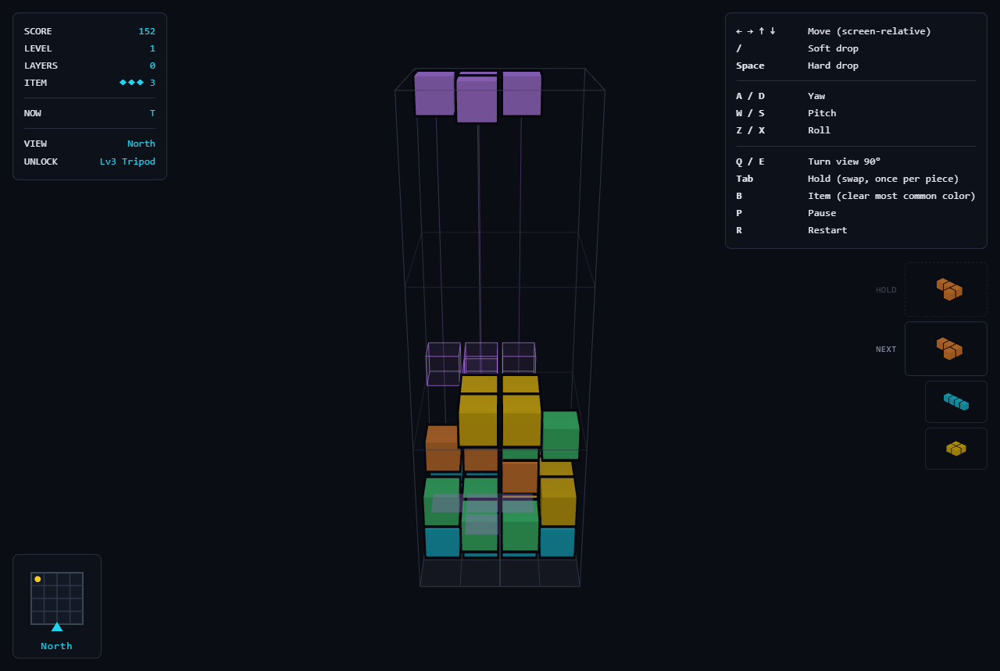
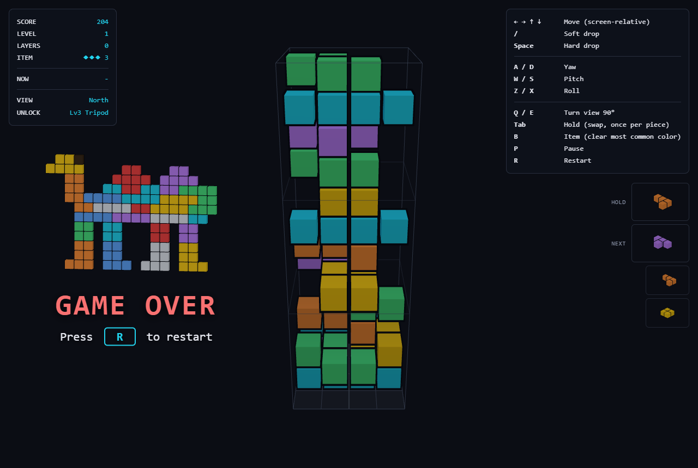

# 3D Tetris

**[▶ Play in your browser](https://mikami2026.github.io/3D_Tetris/)** — desktop only, a keyboard is required.

A 3D falling-block puzzle. Pieces made of four cubes drop into a tall pit with a 4×4 floor.
You can **turn the camera 90° at a time to inspect the board from all four sides**, and the
controls always follow whichever direction you are currently looking from.

[日本語版 README](README.ja.md)



## Features

- **Four viewpoints** — `Q` / `E` turn the camera by 90°. The board never moves, only the camera. Movement keys are remapped to match, so `→` always moves the piece to the right *on screen*
- **Eight tetracubes** — in 3D you can flip a piece over, so S/Z and J/L collapse into single shapes. Three non-planar pieces (Tripod, R-Screw, L-Screw) take their place
- **Gradual unlocks** — you start with the five flat pieces. The Tripod appears at level 3, the two screws at level 5
- **Depth cues** — ghost piece, column lines, floor highlight and a compass. Reading *where a piece will land* is the hard part of 3D Tetris, so these are treated as required features rather than polish
- **Rescue item** — `B` clears every block of the most common color and lets the stack collapse, so a bad board is recoverable

## Controls

| Key | Action |
|---|---|
| `←` `→` | Move left / right on screen |
| `↑` `↓` | Move away from / toward the camera |
| `A` / `D` | Yaw (rotate around the vertical axis) |
| `W` / `S` | Pitch |
| `Z` / `X` | Roll |
| `Q` / `E` | Turn the camera 90° |
| `/` | Soft drop |
| `Space` | Hard drop |
| `Tab` | Hold (swaps with the current piece, once per piece) |
| `B` | Item — clear the most common color |
| `P` | Pause |
| `R` | Restart |

Pitch and roll are resolved against the camera, so `W` always tips the piece away from you
no matter which side you are viewing from.

## Requirements

- A desktop browser with WebGL 2 — current Chrome, Edge, Firefox or Safari
- **A keyboard.** Rotating in three axes needs six keys, so phones and tablets cannot play this yet
- A window of roughly 1024×640 or larger

Keys are read by physical position rather than by printed label, so `WASD` sits in the same
place on every layout. On AZERTY keyboards the labels will not match the help panel.

## Rules

- A **horizontal layer clears when all 16 of its cells are filled**, and everything above it falls
- Clearing several layers at once is worth more (100 / 300 / 700 / 1500 × level)
- The level goes up every 10 cleared layers, and pieces fall a little faster
- Stacking above the visible height of 12 ends the game



## Running locally

```bash
npm install
npm run dev      # opens http://localhost:5173
```

```bash
npm test         # unit tests
npm run typecheck
npm run build    # outputs to dist/
```

3D appearance cannot be covered by unit tests, so there is a script that drives the game in a
headless browser and takes a screenshot. Start `npm run dev` first.

```bash
npm run shot
npm run shot -- --keys "ArrowLeft,ArrowLeft,Space" --width 1000 --height 700
```

## Layout

```
src/
  core/     game rules — imports nothing from Three.js, runs under Node
  render/   Three.js rendering
  input/    keyboard handling and screen-relative mapping
tests/      unit tests
```

**Rules and rendering are kept completely separate.** `core/` never imports Three.js, so the
whole rule set can be tested under Node and a rule bug can never hide behind a rendering bug.
That separation matters here because 3D is awkward to debug by eye.

`core/` also owns the piece geometry. Each piece rotates inside an n×n×n box where the 90°
rotations are exact integer permutations, so repeated rotation can never accumulate drift.
The box edge is 3 or 4 depending on the piece, chosen so its parity matches the piece's own
extents — the same reason 2D SRS uses a 3×3 box for T/L/J/S/Z and a 4×4 box for I/O.

[DESIGN.md](DESIGN.md) records the design decisions and the reasoning behind them,
including several that were revised after playing. **It is written in Japanese.**

## Built with

TypeScript / Three.js / Vite / Vitest

## License

[MIT](LICENSE)
